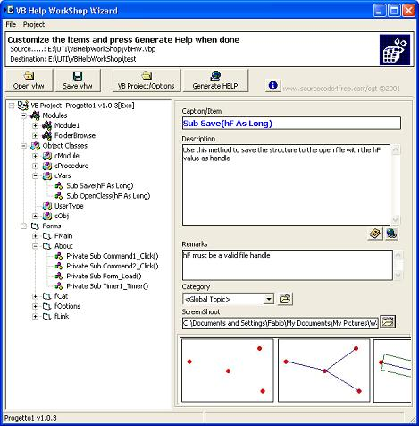



## VBhelWorkShop

### Description

This Wizard read any Visual Basic project and exports it to html

pages to be compiled as *.chm file.

The steps and the informations required allow to build any help

really fast.

The goal of VB Help Workshop is reading a VB project file and translate

it to html pages as Programmin Guide style or Application Documentation

Once the work is done open the hhp project with Microsoft Help Workshop

and compile it as chm file.
 
### More Info
 

             |
---                |---
**Submitted On**   |2001-12-28 07:41:10
**By**             |[Fabio Guerrazzi](https://github.com/Planet-Source-Code/PSCIndex/blob/master/ByAuthor/fabio-guerrazzi.md)
**Level**          |Intermediate
**User Rating**    |4.9 (163 globes from 33 users)
**Compatibility**  |VB 6\.0
**Category**       |[Complete Applications](https://github.com/Planet-Source-Code/PSCIndex/blob/master/ByCategory/complete-applications__1-27.md)
**World**          |[Visual Basic](https://github.com/Planet-Source-Code/PSCIndex/blob/master/ByWorld/visual-basic.md)
**Archive File**   |[VBhelWorkS46455152002\.zip](https://github.com/Planet-Source-Code/fabio-guerrazzi-vbhelworkshop__1-30426/archive/master.zip)

